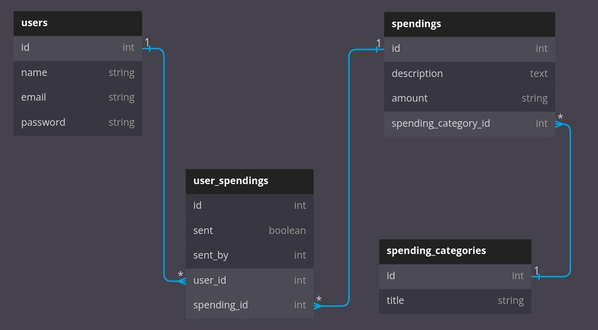

# Expenses tracking app

## DB Schema


## Installation
Follow these easy steps to install and start the app:

### Prerequisites
The setups steps expect following tools installed on the system.

* Github
* Docker

### Check out the repository
```git clone https://github.com/vbiletskiyy/ExpTrack.git```

### Open cd
```cd ExpTrack```

### Set up and start Rails app with Docker
```docker-compose build```

## To get an interactive shell with docker-compose run:
```docker-compose run --rm web bash```

Now you can work inside the container as if you were just using Rails and Ruby on your local machine

Install the gems required by the application:

```bundle install```

## Create and setup the database
```rails db:create```

```rails db:migrate```

## Start the Rails server
Switch to another terminal. You can start the rails server using the command given below.

```docker-compose up```

And now you can visit the site with the URL http://localhost:3000

Use Ctrl-C to stop
